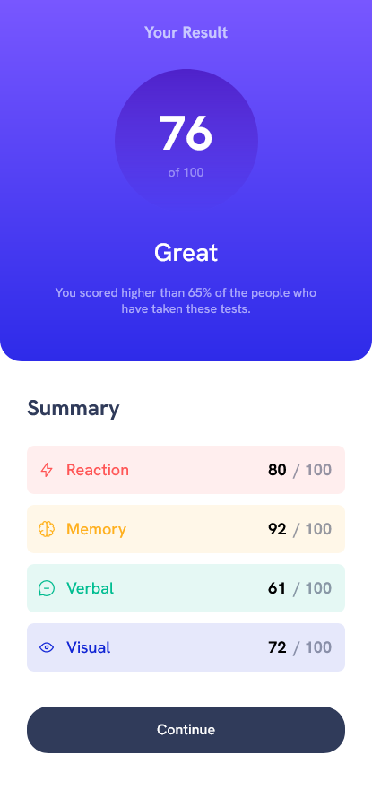

# Frontend Mentor - Results summary component solution

This is a solution to the [Results summary component challenge on Frontend Mentor](https://www.frontendmentor.io/challenges/results-summary-component-CE_K6s0maV).

### Screenshot

### Links

- Solution URL: [-](https://www.frontendmentor.io/solutions/results-summary-component-using-css-flexbox-y2_QSrxIDY)
- Live Site URL: https://magical-donut-707cbf.netlify.app/

### Built with

- Semantic HTML5 markup
- CSS custom properties
- Flexbox
